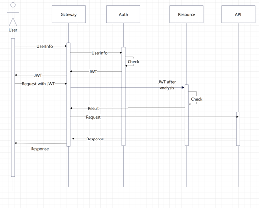
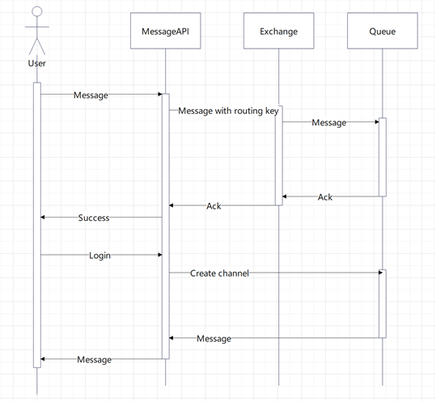
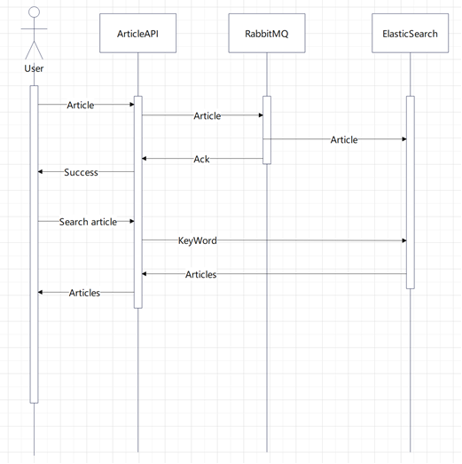

## 介绍

该系统主要实现前后端分离、单点登录、网关鉴权、分布式IM即时通讯以及博客的发布、评论、点赞等功能。静态资源使用NignX部署。博客搜索使用ElasticSearch，使用MQ实现异步数据同步，使用SpringCache、Redis实现系统热点数据缓存。IM通讯基于RabbitMQ、WebSocket实现。

## 技术选型

- 框架 SpringCloudAlibaba 2021.1
- SpringCloud 2020.0.1
- SpringBoot 2.4.2
- JDK 1.8
- 注册中心 Nacos 2.0.3
- 鉴权认证 Oauth2 Security JWT
- 限流熔断 Sentinel
- 分布式事务 Seata
- 网关 Gateway
- 消息队列 RabbitMQ 
- 搜索引擎 ElasticSearch 7.16.2
- 远程调用 Feign
- 数据库 MySQL 8、Redis

## 安装教程

- Nacos
- Sentinel
- Seata
- RabbitMQ（创建交换机message，推送功能使用）
- ElasticSearch（与MySQL内容同步使用MQ最终一致）
- MySQL
- Redis

#### 功能说明

- 用户注册
    密码Bcrypt加密
- 用户登录
    登录时认证鉴权分离，登录时通过白名单到认证服务器用户密码正确则获取JWT，之后请求携带JWT在网关鉴权，查看该路径所对应角色该用户是否属于，并将JWT解析放进请求头中。
    实际流程将应用名、密钥、用户名、密钥发送到/auth/oauth/token经过多个过滤器后将数据库中密码进行hash运算后对输入密码加密后再hash运算比较
- 上传头像
    在文件服务器中提供上传头像的接口，生成UUID，远程调用userapi更改头像的对应文件
- 发布含图片的文章
    采用富文本编辑器，图片使用base64编码存入
- 发送私信
    分布式websocket
    可选方案1、MQ广播，每个推送服务监听一个消息队列，优点占用内存资源少，缺点浪费网络计算资源多 2、MQ中direct模式，每个用户一个队列，在websocket时监听，推送消息时根据userid推送到指定队列，缺点占用内存多，优点网络计算资源少 3、一致性hash，通过一致性hash计算用户的websocket在哪一个服务器是，在网关进行一致性hash算法路由 4、缓存中保存用户连接的websocket所在的服务器IP，推送消息时找到消息接收用户所在的服务器通过restful接口推送。
    本项目采用第二种方式。
- 系统推送
    原理也是分布式websocket，登陆时创建websocket连接，之后所有的推送都通过MQ推送到指定用户队列中，通信使用自定义消息格式（message or notice）
- 评论区
    每条评论记录文章与评论两字段，对于一篇文章查找所有文章id为该文章的评论，之后根据评论id再排序（对文章的评论按时间排序的基础上对评论的评论再按时间排序）
- 高亮搜索
    对查询结果高亮显示

## 实现架构
### 鉴权认证
网关作为后端所有服务的接口，对所有请求负责鉴权认证。如果是登录请求网关将带有用户登录信息的请求转发到Auth（认证服务器），Auth经过用户名密码校验成功后发放JWT。之后请求API携带JWT在网关调用资源服务器后解析出JWT中角色信息，如果角色拥有访问资源则将请求转发到API服务中。JWT发放前经过Auth服务RSA的私钥加密，在资源服务器解析JWT时还需从Auth中获取公钥，如果公钥解析失败说明JWT被篡改。

### 消息推送
基于RabbitMQ实现将消息推送到建立WebSocket连接在不同服务上的用户。在RabbitMQ中创建message业务的交换机，在用户注册时动态创建用户ID为标识的Queue，当用户在某个会话中发送消息MessageAPI将消息携带用户ID作为routing key发送到RabbitMQ，Exchange根据routing key将消息路由到绑定在该Exchange上相应的Queue。当WebSocket与服务建立连接时创建channel获取Queue中推送给该用户的消息。IM通讯功能中访问MessageAPI鉴权部分与上图中访问API一致，下图省去该过程。

### 博客
为提高搜索效率使用了ElasticSearch，需要解决MySQL与ElasticSearch之间的数据一致性，同步调用会导致调用链过长增加响应时延降低性能。该项目中通过RabbitMQ异步实现博客数据同步。

## 技术问题

1、	浏览器存在安全策略导致不同协议、域名、端口的地址不能直接访问，这种问题叫做跨域，需要虚拟主机代理请求或者在服务提供入口实现反向代理。

2、	Mybatis二级缓存与Redis结合可实现分布式缓存功能，但存在不同命名空间下改写后出现读取脏数据，需要实现不会出现脏读的缓存逻辑，并且要避免缓存击穿等问题。

3、	ElasticSearch、Nacos、RabbitMQ、MySQL、Redis需要配置集群实现分布式容错。

4、	消息队列需要实现动态创建队列以及建立channel实现获得MQ推送的消息。

5、	微服务不同服务间如果没有统一的认证手段则会出现每访问一个服务都需要进行一次登录，为避免此情况需要实现单点登录功能。鉴权逻辑也需要封装内聚为服务供网关调用否则在每个服务中都需要重复编写鉴权逻辑。

6、	WebSocket Session未实现序列化，不能通过外部存储解决服务间WebSocket无关性，需要实现将消息发送到分布式WebSocket的方案。